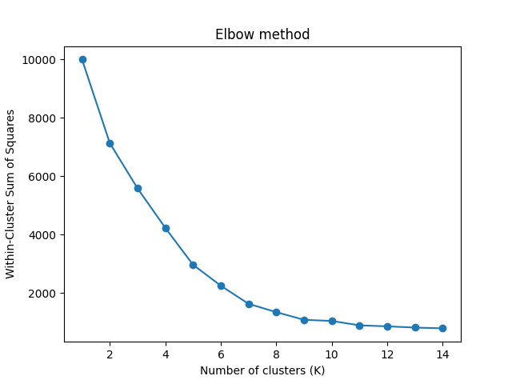
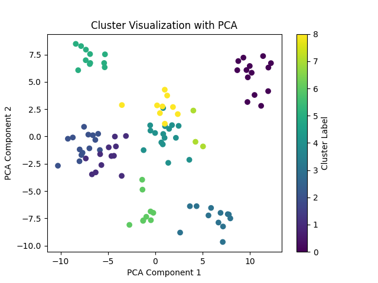
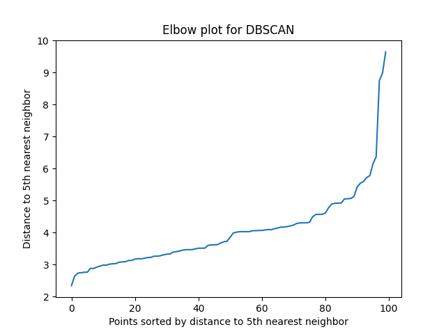
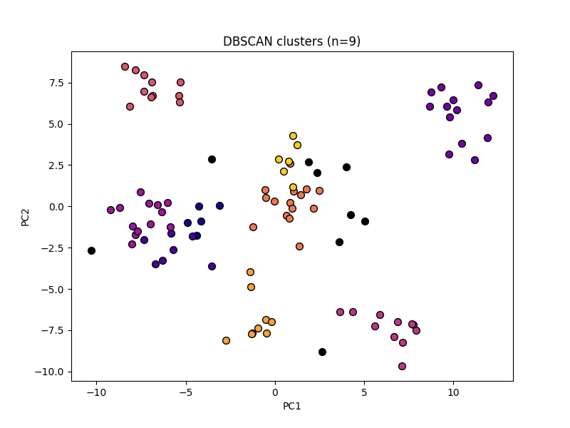
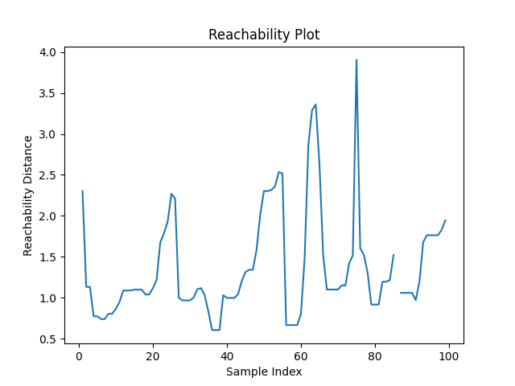
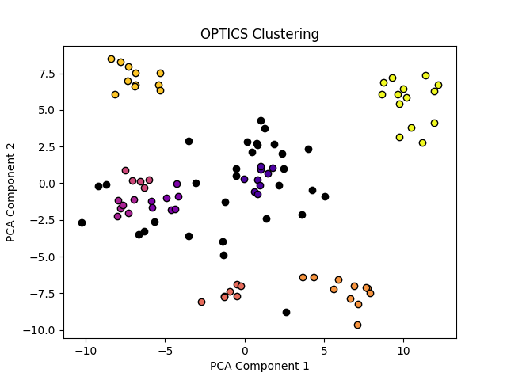

# K-Means, DBSCAN, and OPTICS clustering

## Pre-processing:
- The dataset:
    - Gene expression data from 100 genes
        - Data is unlabeled, though there is a "ground truth" to compare back to
        - Ground truth says there are 10 unique cell types
    - 100 training samples
- The problem:
    - Use clustering algorithms to identify and group cell types together based on their similarities in gene expression

## K-Means Clustering

K-Means clustering groups points into K clusters. K number of points are randomly initalized as cluster centers (or centroids). Each point is then 'assigned', or clustered, to the nearest centroid based on euclidean distance (though, manhattan distance could also be used, but I stuck with euclidean for this example). After clusters are formed, centroids are re-calculated to represent the mean of all the data points assigned to that cluster. It basically becomes the average coordinate in the feature space of all the points in that cluster.  

This process continues on for either a pre-set number of iterations or until the centroids stop moving or cluster assignments stop changing (i.e., convergence). In this example, we iterated until convergence.  

#### Results:  

**Figure.** Selection of K (number of clusters) in K-Means is difficult. I know, based on the "ground truth", that there should be 10 clusters of unique cells. However, in the real-world, you wouldn't have this information. So, one approach to selecting an appropriate K is by looking at an elbow plot (below). An elbow plot shows the within-clusters sum of squares, or the sum of the squared euclidean distances between all points within a cluster. You can do this for various values of K. As K increases, naturally the within-cluster distances get smaller (clusters are limitted to just points that are closer together). However, that doesn't necessarily mean that higher values are "better" for K. What we are really looking for is a bend point in the plot, where continuing to increase K results in progressively smaller improvements in within-clusters distances. **The plot bends at a value of K somewhere around 8, 9, or 10. I will use K=9 for this example.**  


<br>
<br>

**Figure.** K-means clustering was then applied until convergence of centroids and clustering assignments. Below is a representation of the clusters. The x- and y-axis are Principal Components from a PCA on the 100 input features.  


<br>
<br>

## DBSCAN

DBSCAN is a density-based clustering algorithm. The problem with K-means is that it fails to account for differences in the densities of various clusters. For example, one very dense cluster (points that are all very close to each other) would be clustered together based on k-means, but a second cluster with lower density (points are spread out more, but still clearly all make one cluster) might be split into two or more clusters. The manual selection of K is also a problem. As shown in the elbow plot above, I could have selected any value for K. K-means also forces all points to be included in a cluster, even if some points might reasonably be considered noise.  

DBSCAN uses the density of points to build clusters. It starts be randomly selecting a point, then checking to see if it is a core point. For it to be a core point, it must have at least ```MinPts``` within an ```epsilon``` (Eps) distance from it. I get to select MinPts and Eps, but basically what we are saying is that your core points have lots of other points within a certain distance of it (i.e., it is clustered somewhat densely). Clusters are developed by:  
1. Finding a core point
2. Making that core point the start of a new cluster
3. Adding all the other points within Eps distance of that core point to the cluster
4. Searching for other points within the cluster that would meet the criteria of being a core point (likely several, depending on how dense the cluster is)
5. If there are other core points, adding all other points within *their* Eps distance to the cluster
6. Continuing on until all other points in the dataset are outside of the Eps distance for the core points in the cluster. 
7. Randomly select another non-clustered point and start again at #1 
8. For points that are not core points and do not fall within Eps distance of another core point (i.e., cannot be assigned to any clusters), label them as **Noise**  

This iteration continues on until all points have been either assigned to a cluster or labeled as noise. The two key decisions in DBSCAN are the selection of ```MinPts``` and ```Eps```. To select each, you can view nearest neighbor plots. A NN plot shows the euclidean distance to the MinPts nearest neighboring point for every training example in your dataset. The plot is sorted from shortest distance to longest distance, so it will always show an increasing line. What we are looking for is a bend point, where distances go from increasing steadily to increasing sharply. This is the distance, based on a certain value of MinPts, where cluster densities increase dramatically and typically indicates that points to the right/above the bend are either part of loosely connected clusters or are noise points. That bend point is the value we use for Eps. Figure below:  

**Figure.** Nearest neighbor plot for selecting MinPts and Eps in DBSCAN. I visualized MinPts of [2, 3, 5, 7, 9], and ultimately selected MinPts=5 because it resulted in the clearest bend. It would be reasonable to also consider 7 or 9 for MinPts. Important to note is that MinPts does not determine the number of clusters, as that is determined by the DBSCAN algorithm as described above. It just designates the conditions under which a point would be considered a core point.  


<br>
<br>

**Figure.** Based on the plot above, I used a MinPts of 5 and an Eps of 4.5, which is about the point on the y-axis where the plot turns upward. There are no iterations in DBSCAN, it continues on until all points have either been clustered or labeled as noise. The DBSCAN algorithm identified 9 clusters (very close to the ground truth of 10!!), as shown in the 2-D plot below.  


<br>
<br>

## OPTICS

OPTICS is very similar to DBSCAN, with the exception that OPTICS will cluster with a more flexible epsilon distance. Though DBSCAN works for clusters of varying densities, it still falls short when used with highly diverse clusters. OPTICS starts by selecting a point in the dataset. It then determines if that point could be considered a core point (same as DBSCAN above, has MinPts within Eps distance of it). If it's not a core point, it moves on to another point. If it is a core point, we take each point in the neighborhood and measure (a) the distance between that neighboring point and the core point that we started with, and (b) the distance between that core point and the N-th point nearest to it (where N = MinPts), which esentially represents how large the neighborhood would be at its smallest to still be considered a neighborhood. We then assign a ```reachability``` value to each neighboring point (in the full neighborhood, not the smaller one like in measurement b) which is the Max of measurements a and b. So, essentially we are saying that the reachability distance between a neighborng point and a core point is either the actual distance between those two points, or it is the maximum distance that makes the core point a core point (i.e., distance to N-th neighbor), whichever is larger. The core point does not get a reachability distance to start with. However, after OPTICS has assigned a reachability distance to every point in the neighborhood, we then go to the next closest point in the neighborhood, and again decide if it is a core point. If not, we go to the next closest point from there (continuing on untill all points have been 'visited'). At the next core point, the same measurement process takes place. However, when a reachability distance has already been calculated for a point (which will be common, since we are going from close point to close point in the progession), the reachability distance for that point will only be updated if it is smaller than the current reachability distance it has stored.  

Based on reachability distances, a reachability plot is constructed. The reachability plot shows how "close" points are to each other. Lower values on the plot show regions where points are closely clustered together, and spikes on the plot help to separate two clusters which are not close to each other in distance. Peaks can also be noise points, as they are not close in reachability to any other core points. Gaps in the plot mean that a point is not a core point, and does not fall in the neighborhood of any other core points; thus, a reachability distance could not be calculated (i.e., it is a noise point). 

**Figure.** Below is the reachability plot for the OPTICS algorithm. I used a MinPts value of 5 and an Eps of 5.5. Peaks are noise points, valleys are clusters of varying densities.  


<br>
<br>

**Figure.** After running OPTICS, we identified 8 clusters.  


<br>
<br>