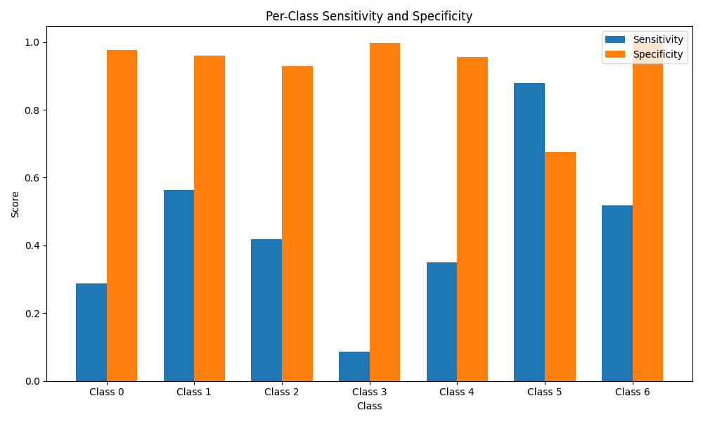
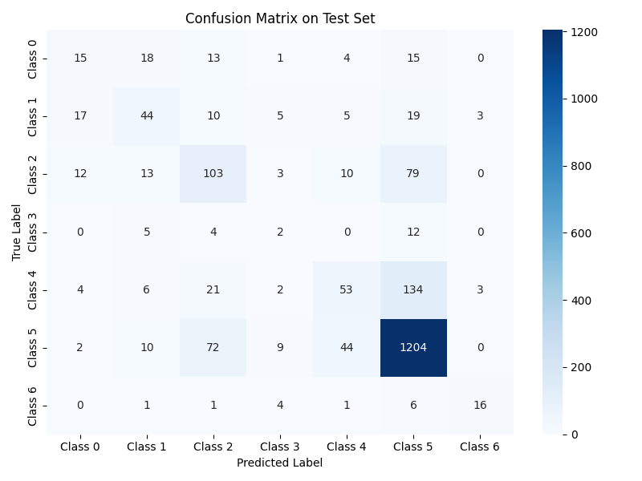
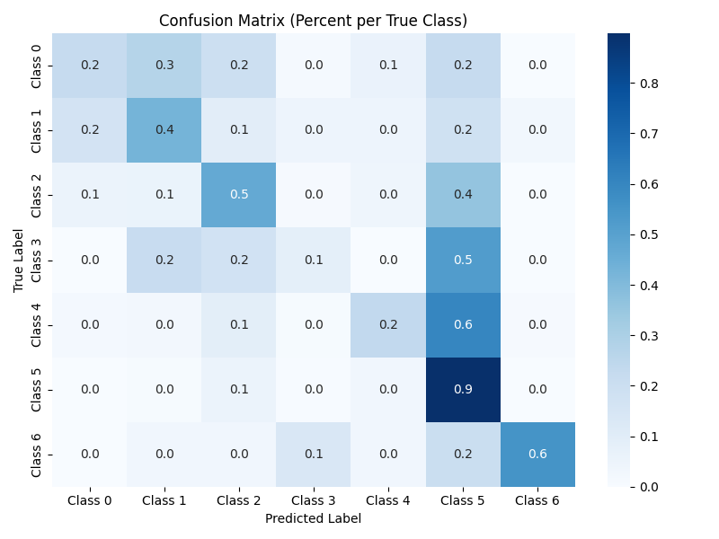

# Predicting skin lesion types from images

This convolutional neural network (CNN) was designed to test multi-class image classification 
using the DermaMNIST dataset from MedMNIST. The architecture begins with several convolutional 
layers, followed by flattened, 1D fully connected layers, eventually resulting in an output the 
same size as the number of target classes.  

### Convolutional Layers:

- Three layers total 
    - 32 filters, 64 filters, and 128 filters
    - Each with a 3x3 kernel with no padding
        - no padding reduces image size, but can fail to properly reflect the edges of an image in 
        filter representations
        - That is okay in this example because:
            - The lesions are centered in each image
            - The edges do not contain important information
                - Edges actually just contain skin, and not lesion sections
- LeakyReLU activation 
    - Allows for some negative values to prevent vanishing gradients in early layers
- Dropout after each layer
    - 30% dropout to prevent overfitting and train neurons more diversely 
- MaxPooling (2x2) after each convolution
    - Captures largest values within regions
    - Down-sizes images at each layer
- Final layer uses mean pooling (still 2x2) to smooth out representations
    

### Fully Connected Layers: 

- Four fully connected layers
    - 128 feature inputs from feature maps
    - Mapped to 64, 32, 16
    - Final layer outputs to the number of target classes
- LeakyReLU activation again
- Dropout at 30%
- Final layer is linear without activation
    - Raw logits work for Focal Loss function

### Training
- Focal Loss used as loss function 
    - Used when class imbalance is present 
    - And when some instances are harder to classify
        - Focal loss up-weights samples that are difficult to classify in an attempt to improve classification performance for those cases
        - Has strong clinical utility...
            - If cases are easy to classify, they wouldn't need a prediction model to classify them. A doctor would do it.
            - Model really only provides benefit in a clinical setting if it can help with the "hard to classify" cases. 
- Run for 200 epochs, mini-batch GD with batch sizes of 128

### Results:

The dataset has 7 different classes. In the test set, the class distribution is:  
- Class 0: 228 samples
- Class 1: 359 samples
- Class 2: 769 samples
- Class 3: 80 samples
- Class 4: 779 samples
- Class 5: 4693 samples
- Class 6: 99 samples

After 200 epochs of training, the accuracy in the training set was 93.1%. The accuracy in the test set was 71.7%.  

**Figure.** Sensitivity and Specificity for each class in the test set. 

 
 

**Figure.** Confusion matrix showing model class predictions and actual class values for the test set. 

  

**Figure.** Confusion matrix showing model class predictions and actual class values for the test set, normalized to a percentage across each row (each row sums to 100%). 

  