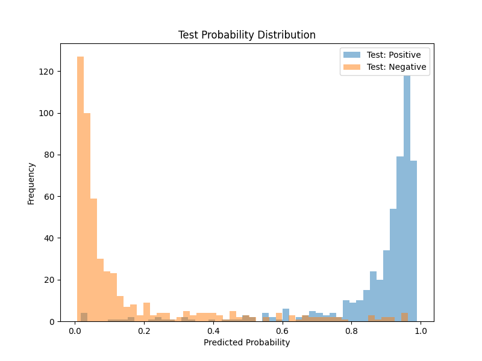
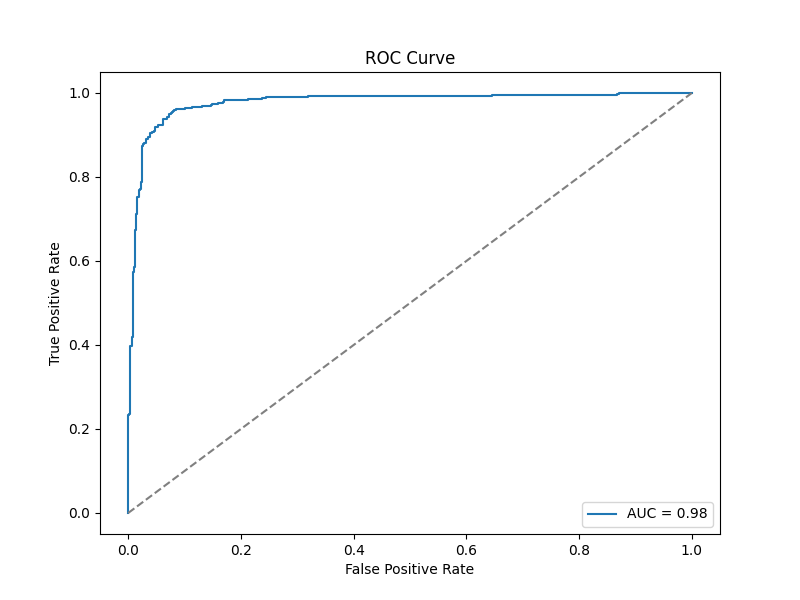

# Cancer prediction using Gene Expression Data

This project demonstrates a fully connected feedforward neural network implemented in PyTorch for 
binary classification. The dataset contains gene expressions, and the target is trying to predict if a cell is cancerous. 

## Architecture:
- Input Layer: Takes ```nFeatures``` continuous features
- Hidden Layers:
    - Defined in the training function ```hidden_sizes```
    - Default option is two layers with 50 neurons each
    - Actual size used in this example is 50x10, or two layers with 50 and 10 neurons
    - Each layer uses a sigmoid activation
- Output Layer:
    - One neuron with sigmoid activation
    - Outputs a probability of having cancer from 0 to 1
- Loss function: Binary Cross-Entropy
- Optimizer: Stochastic Gradient Descent (SGD)
- Batching: Mini-batch training
    - Default batch size is 500, which is what I used in this example
- Epochs: 2500 iterations

## Performance Evals
- Accuracy, Sensitivity, Specificity (clinically-focused preformance metrics)
- Probability distribution plots on the test data 
- ROC/AUC in the test data

## Results! 

The training data contained 500 features and 8000 training samples. The validation and test data 
contained 1000 samples each, for a train/val/test split of 80/10/10.  

In the final epoch of training, the train accuracy was 98.7%, and validation accuracy was 93.5%. In 
the test set, accuracy was 93.9%, sensitivity was 95.5%, and specificity was 92.2%. 

The distribution plot shows strong separation between classes. A model with only two layers and run 
for 2500 epochs successfully distinguished between cell that are vs are not cancerous.  

**Figure.** Distribution of predicted probabilites for each class in the test set.  

<br>

**Figure.** The model AUC in the test set was 0.98.  

<br>