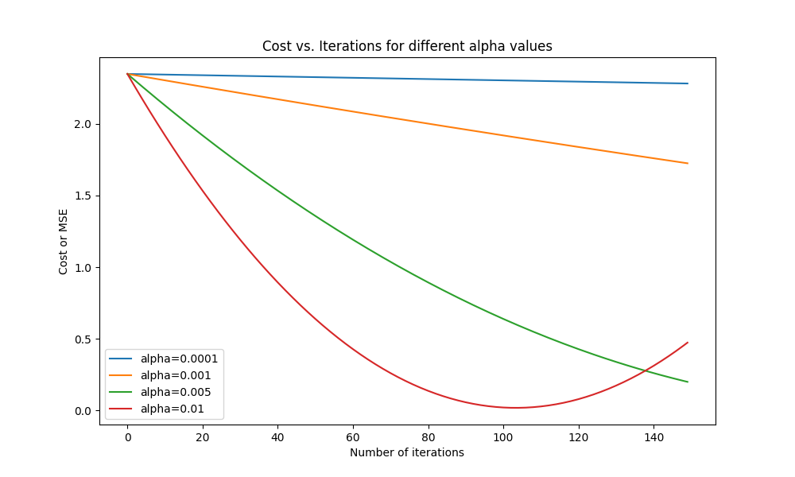

# Simple gradient descent for network without activation function:

The example Python script demonstrates the proccess of gradient descent, from weight initializations and forward passes, through the derivative calculations and weight updates 
that make up backpropogation. I end the example by iterating through gradient descent for 150 iteration, with varying learning rates (0.0001 to 0.010). The resulting cost vs 
iteration figure is shown below. This approach did not include an activation function, thus derivative calculations are fairly straightforward.  
<br>

### The process:
- Generate data
    - Start with a ground truth for weights and bias
    - But also add some small variability
- Standardize inputs
- Initialize weights and bias
- Define a function for forward pass
    - Just a linear combination of weights, features, and bias
    - No activation for this example
- Define a function for getting the cost
    - Mean Squared Error for this example
- Define a function for backpropogation to update weights
    - Need separate sections for bias updates and weight updates
- Put it all together in a simple ```for``` loop! 
- Run the loop with different learning rates  

### Figure! 

**Figure.** Cost (mean squared error in this example) vs iterations plot, with a line for various learning rates (alphas). 
