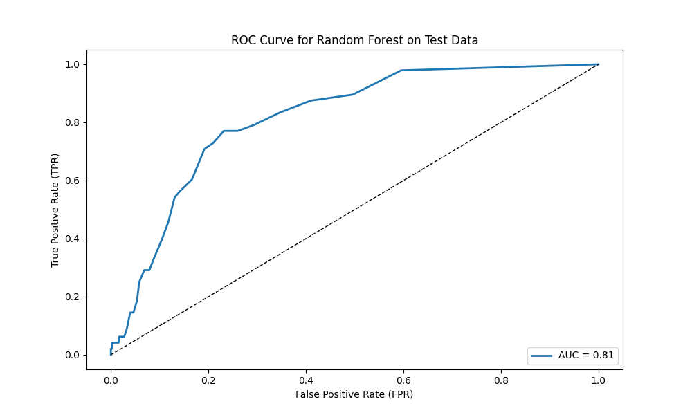

# Support Vector Machine and Random Forest Example!

This Python script explores support vector machines, random forests, and logistic regression approaches to classification problems.  

### Overview:
**Example Dataset:** Data (n=4981) on patients who did and did not sustain a brain stroke. Predictors include demographics (age, gender, marital status), medical history/characteristics (hypertension, heart_disease, average glucose levels, BMI), and additional information on suspected stroke risk factors (smoking status, occupation).  

**Pre-processing:** 
- One-hot encoding of categoricals that were not already binary
- ```SKlearn LabelEncoder``` to convert string categorical levels to 0 or 1
- ```SKlearn StandardScaler``` to standardize continuous numeric variables
- 80%/20% train-test split 
    - Only did the one split here. In the future, consider multiple split to confirm results are not due to 'lucky split'. 
    - In the future, consider a train-validation-test split for model hyperparameter tuning. 
### Findings:

#### Random Forests:

The random forest model trained using the training data (80% train-test split) had a 100% accuracy in the training data. This is generally a sign of overfitting to the training data, which is makes sense in this case given that we did not adjust hyperparameters at all. The model is likely developing trees that are extremely deep and are capitalizing on small nuances/noise in the data to correctly classify each individual instance in the training data.  

The model was 95.2% accurate on the testing data. Most notably, the precision and recall scores for the positive class were 0.50 (or 50%) and 0.02 (or 2%), respectively, indicating that the model almost always predicts the negative (majority) class. The model is failing to identify the positive class (poor recall) and is inacurate when predicting the positive class (poor precision).  

The random forest model had an AUC of 0.81 in the test data. However, AUC can be misleading due to class imbalance.  

**Figure.** ROC curve and AUC value for the random forest model predicting stroke.  


<br>

Predicted probabilities from the random forest model show a similar trend, the model tends to predict a very low probability of stroke for all subjects. A classification threshold of 0.50 may not be appropriate in this example, and a threshold closer to 0.10 may result in better performance in the positive class (though, at the expense of performance in the negative class). The real solution is developing a better model and using sample wieghts to handle the problem of class imbalance.  


**Figure.** Kernel Density Estimates of the predicted probabilities of stroke from the random forest model.  


<br>


#### Support Vector Machine:

The SVM had an accuracy of 76.9% in the training data and 75.5% in the testing data. Recall improved substantally compared to the random forest approach, with a SVM recall of 0.69. However, this is more likely attributed to the built-in ```class_weight``` argument for SKlearn's SVC function. I used a balanced class weight, which assigns sample weights that are inversely proportional to class frequencies in the target variable.  

The SVM had an AUC of 0.80 in the test data. 

**Figure.** ROC curve and AUC value for the SVM predicting stroke.  


<br>

Predicted probabilities from the SVM model again show significant overlap in the predicted probabilities between the two classes. The SVM is still struggling to distinguish between classes and has a tendancy to predict the negative class most often. However, this is less pronounced than that of the random forest model, which almost exclusively predicted the negative class. 

**Figure.** Kernel Density Estimates of the predicted probabilities of stroke from the SVM.  


<br>


#### Logistic Regression model:

The logistic regression model had an accuracy of 73.5% in the training data and 74.0% in the testing data. Recall again improved substantally compared to both the random forest and SVM approaches, with a logistic regression recall of 0.81. Balanced class-weights were again used to manage the class imbalance issue.   

The logistic regression had an AUC of 0.80 in the test data. 

**Figure.** ROC curve and AUC value for the logistic regression predicting stroke.  


<br>

Predicted probabilities from the regression model show a much better division between classes. This is a great example of why accuracy and AUC are poor metrics in classification problems with significant class imbalance in the target variable - without proper class re-weighting, the models tend to predict the majority class in order to reduce error.  

**Figure.** Kernel Density Estimates of the predicted probabilities of stroke from the regression.  


<br>